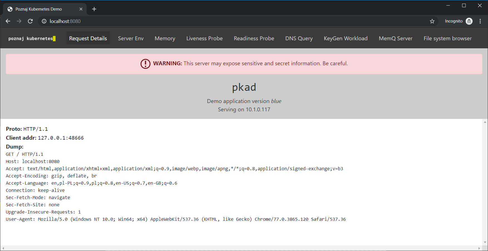

# Demo application for "Poznaj Kubernetes"
Based (and forked) from "Kubernetes Up and Running" KUARD app.



### Running

```
kubectl run --restart=Never --image=poznajkubernetes/pkad:blue pkad
kubectl port-forward pkad 8080:8080
```

Open your browser to [http://localhost:8080](http://localhost:8080).


### KeyGen Workload

To help simulate batch workers, we have a synthetic workload of generating 4096 bit RSA keys.  This can be configured through the UI or the command line.

```
--keygen-enable               Enable KeyGen workload
--keygen-exit-code int        Exit code when workload complete
--keygen-exit-on-complete     Exit after workload is complete
--keygen-memq-queue string    The MemQ server queue to use. If MemQ is used, other limits are ignored.
--keygen-memq-server string   The MemQ server to draw work items from.  If MemQ is used, other limits are ignored.
--keygen-num-to-gen int       The number of keys to generate. Set to 0 for infinite
--keygen-time-to-run int      The target run time in seconds. Set to 0 for infinite
```

### MemQ server

We also have a simple in memory queue with REST API.  This is based heavily on https://github.com/kelseyhightower/memq.

The API is as follows with URLs being relative to `<server addr>/memq/server`.  See `pkg/memq/types.go` for the data structures returned.

| Method | Url | Desc
| --- | --- | ---
| `GET` | `/stats` | Get stats on all queues
| `PUT` | `/queues/:queue` | Create a queue
| `DELETE` | `/queues/:queue` | Delete a queue
| `POST` | `/queues/:queue/drain` | Discard all items in queue
| `POST` | `/queues/:queue/enqueue` | Add item to queue.  Body is plain text. Response is message object.
| `POST` | `/queues/:queue/dequeue` | Grab an item off the queue and return it. Returns a 204 "No Content" if queue is empty.

### Versions

Images built will automatically have the git version (based on tag) applied.  In addition, there is an idea of a "fake version".  This is used so that we can use the same basic server to demonstrate upgrade scenarios.

Versions `1`, `2`, and `3` are confusing, so we will be using colors instead: `blue`, `green` and `purple`. This translates into the following container images:

```
poznajkubernets/pkad:blue
poznajkubernets/pkad:green
poznajkubernets/pkad:purple
```

For documentation where you want to demonstrate using versions but use the latest version of this server, you can simply reference `poznajkubernets/pkad:blue`.  You can then demonstrate an upgrade with `poznajkubernets/pkad:green`.